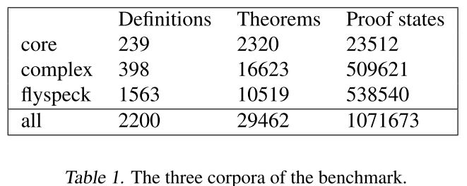
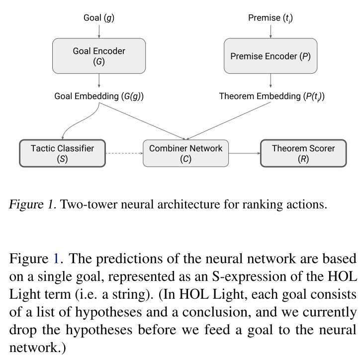

# HOList : An Environment for Machine Learning of Higher-Order Theorem Proving 
## (K. Bansal & S. Loos et al., 2019)
## Brief Intro 
The paper presents:
1. Environment, that is, the HOL Light theroem prover that can be used as a reinforcement learning environment,
2. Benchmark, 
3. Deeplearning-based theorem prover for HOL, which is named DeepHOL.

HOL Light is a interactive theorem prover that broadly covers basic mathematical theorems on calculus and the formal proof of the Kepler conjecture. 

The authors declared their contributions as follow, 
1. a instrumented, pre-packaged version of HOL Light that can be used for reinforcement learning
2. proof export and import capabilities 
3. a automated neural theorem prover 
4. comparison of neural models 
5. well-defined benchmarks on the HOL Light based environment. 

## Architecture 

### 1. RL Environment 

In order to set the learning environment for theorem proving, the authors modified a particular version of HOL Light. The modified package is able to: 
* Logging of human-written proofs shipped with HOL Light. 
* A few API to interact with HOL Light for proof search. 
* Fast startup for distributed proof search. 
* A proof checker to remove the need to trust search algorithms.

### 2. Benchmark 

The authors presents three different copora: "core", "complex", and "flyspeck". The data is descriped in Table 1. 

Through the benchmark, two tasks can be measured, which are, 
* Predict the tactic and tactic arguments (that were employed in the human proof).
* Prove each of the theorems in the corpora (while utilizing only those theorems as tactic arguments).

1. Traing Samples 
Training examples consist of a *goal*, a *tactic*, an *arglist*, a *negarglist*. 
The *arglist* is the list of theroems that were passed to a tactic application as arguments. 
The *negarglist* is an optional list of non-arguments that is not actually necessary for any proof. The non-argument theorems are collected during proof search in the reinforcement learning pipeline later. 
2. Representation of Expressions 
The paper uses the S-expression to represent formulas. 
Actually, this is the paper witten before (Paliwal et al., 2020), and you can refer to the prelude part of our previous post ([here](https://mathprocessing.wordpress.com/2020/06/02/paper-review-palliwal-et-al-2019/)) to understand more about the S-expression. 

### 3. DeepHOL Prover 

* Little notion about RL (if you are  familiar with RL, you can just ignore this)
Basic reinforcement is modeled as Markov decision process. The components are as following:
    - a set of environemnt and agent states, *S*;
    - a set of actions, *A*, of the agents; 
    - *Pa(s, s') = Pr(st+1 = s' | st = s, at = a)* is the probability of transition from *s* to *s'* with action *a*.
    - rules that describe what the agent observes.

The most crucial part of the prover is the action generator. Its role is
producing a list of tactic applications for a given goal, which is splitted into two subtasks by the authors: 
1) To rank the tactics, and 
2) to create an argument list for each of the tactics (a list of theorems).

For both subtasks, the action generator emplyes a neural network. The ranking of tactics is used in *proof search*  to expend the *proof search graph*.  
The proof search graph is the data structure that the authors came up with to capture the state of the proof search. 
<!--- more to write about..--->

The proof search process is a simple breadth first search. To reach/resolve a goal, it calls the action generator to generate a list of tactic applications, and applies it in order.
<!--- more to write about..--->

Figure 1 shows the neural network that the action generator uses for each proof search step. 

<!--- more to write about each networks..--->

In the reinforcement learning loop, the authors have both a trianer and multiple provers running continuously. 
The training can start with optional seeding process. The neural prover is runned in *rounds*, each round trying to prove a random sample of theorems. The training example pools make additional distinguish between more recent rounds (*fresh* examples can be weighted differently) and order rounds (*historical* examples).    
During training, the model also ensures that examples from freshly constructed new proofs show up quickly and deterministically during the training process. 

